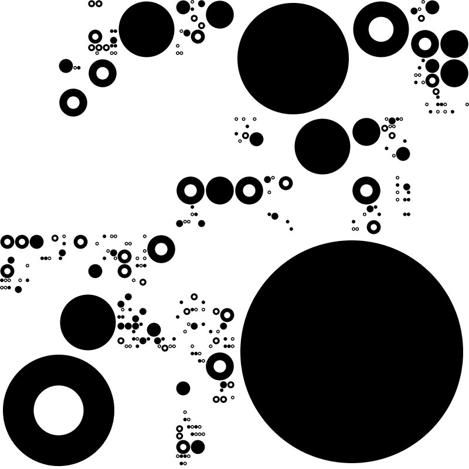

Fractal Circles
================

This is a pretty cleaned-up version of the code that generates the Fractal
Circles. (I took out the gunk that only saves a PDF if it has a certain depth
of recursion, PDF file renaming, failed style experiments, etc.)

The algorithm is simple:
* take a rectangle
* decide: should we divide it up, or stop?
* if we stop, decide: should we draw a circle?
  * if we draw a circle, should it be solid? or hollow? or no circle at all?
* if we decide to devide it up, split the rectangle in half.
  * if this rectangle is tall, split it into an upper- and lower-half
  * if this rectangle is wide, split it into a left- and right-half
  * do this whole thing again in each of them
