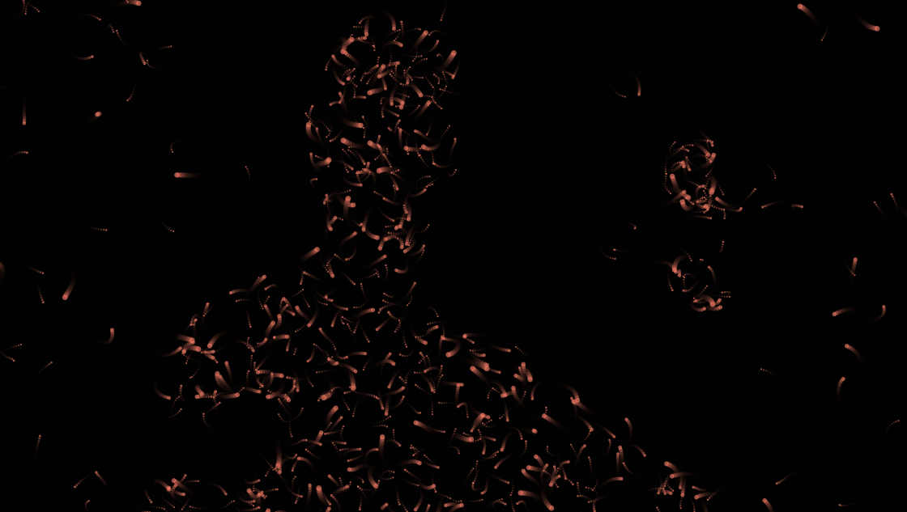

Lightbugs
================

Lightbugs is a particle system where the particles search for bright spots in
an underlying, invisible black-and-white image.

The underlying image can be anything - a PNG file, some text, a sine wave - but
in this case, it's connected to a webcam, and they search for differences
between the current frame and the first frame the webcam saw when the sketch
started.  This means it tracks movement pretty effectively.

There are lots of improvements that could be made to the code, but this works
well enough.
